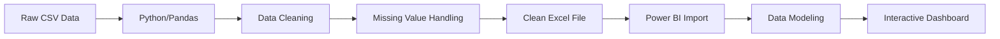

# Hashfi_Sales_Data
# 📊 Sales Data Visualization Dashboard with Power BI


A comprehensive end-to-end data analytics project showcasing sales data visualization using Microsoft Power BI, from data cleaning with Python to interactive dashboard creation.

## 📋 Table of Contents
- [Overview](#overview)
- [Features](#features)
- [Tech Stack](#tech-stack)
- [Project Structure](#project-structure)
- [Installation](#installation)
- [Usage](#usage)
- [Data Pipeline](#data-pipeline)
- [Dashboard Components](#dashboard-components)
- [Key Insights](#key-insights)
- [Screenshots](#screenshots)
- [Contributing](#contributing)
- [License](#license)
- [Contact](#contact)

## 🎯 Overview

This project demonstrates a complete workflow of business intelligence analysis, combining Python for data preprocessing and Microsoft Power BI for creating interactive visualizations. The dashboard provides comprehensive insights into sales performance across multiple dimensions including geography, product categories, customer segments, and time series trends.

**Dataset:** 9,994 sales transactions with 21 attributes
**Timeframe:** 2018-2021
**Geographic Coverage:** United States

## ✨ Features

- 🧹 **Automated Data Cleaning** - Python-based preprocessing pipeline
- 📈 **Interactive Visualizations** - 7 distinct chart types for comprehensive analysis
- 🗺️ **Geographic Analysis** - State-level sales distribution with aerial map view
- 📊 **KPI Tracking** - Real-time metrics for Sales, Profit, Quantity, and Discount
- 🔄 **Cross-filtering** - Interactive drill-down capabilities across all visualizations
- 🎨 **Professional Design** - Cohesive color scheme and intuitive layout
- 📱 **Responsive Layout** - Optimized for various screen sizes

## 🛠️ Tech Stack

**Data Cleaning & Analysis:**
- Python 3.x
- Pandas
- NumPy
- Seaborn
- Jupyter Notebook

**Visualization:**
- Microsoft Power BI Desktop
- Power Query
- DAX (Data Analysis Expressions)

## 📁 Project Structure

```
sales-dashboard-powerbi/
│
├── data/
│   ├── sales_data.csv                 # Raw data
│   └── sales_data_cleaned.xlsx        # Cleaned data
│
├── notebooks/
│   └── data_cleaning.ipynb            # Jupyter notebook for data preprocessing
│
├── dashboard/
│   └── sales_dashboard.pbix           # Power BI dashboard file
│
├── screenshots/
│   ├── dashboard_overview.png
│   ├── data_cleaning_process.png
│   └── visualizations/
│
├── docs/
│   └── portfolio_documentation.pdf    # Detailed project documentation
│
├── README.md
├── requirements.txt
└── LICENSE
```

## 🚀 Installation

### Prerequisites

- Python 3.8 or higher
- Microsoft Power BI Desktop
- Jupyter Notebook

### Setup Instructions

1. **Clone the repository**
```bash
git clone https://github.com/yourusername/sales-dashboard-powerbi.git
cd sales-dashboard-powerbi
```

2. **Create virtual environment**
```bash
python -m venv venv
source venv/bin/activate  # On Windows: venv\Scripts\activate
```

3. **Install dependencies**
```bash
pip install -r requirements.txt
```

4. **Download Power BI Desktop**
- Visit [Microsoft Power BI](https://powerbi.microsoft.com/desktop/)
- Install the latest version

## 💻 Usage

### Data Cleaning Process

1. Open Jupyter Notebook:
```bash
jupyter notebook notebooks/data_cleaning.ipynb
```

2. Run all cells to process the raw data:
   - Import libraries and load data
   - Check for duplicates and missing values
   - Clean and transform data
   - Export cleaned data as Excel file

### Dashboard Visualization

1. Open Power BI Desktop
2. Load `dashboard/sales_dashboard.pbix`
3. Refresh data connection if needed
4. Explore interactive visualizations

**Alternative:** Load cleaned data directly:
- File → Get Data → Excel
- Select `data/sales_data_cleaned.xlsx`
- Build visualizations following the documentation

## 🔄 Data Pipeline



### Data Cleaning Steps

1. **Initial Assessment**
   - Dataset: 9,994 rows × 21 columns
   - Data types: Integer (2), Float (4), Object (15)

2. **Quality Checks**
   ```python
   # Check duplicates
   df.duplicated().sum()  # Result: 0 duplicates
   
   # Check missing values
   df.isna().sum()        # Result: 0.11% in Postal Code only
   ```

3. **Data Cleaning**
   ```python
   # Remove column with minimal missing values
   df = df.drop(columns=['Postal Code'])
   
   # Export cleaned data
   df.to_excel('sales_data_cleaned.xlsx', index=False)
   ```

## 📊 Dashboard Components

### 1. **Donut Chart - Sales by Region**
- Visualizes regional sales distribution
- Quick identification of top-performing regions
- Interactive filtering across all visuals

### 2. **Funnel Chart - Sales by Sub-Category**
- Ranks product sub-categories by performance
- Helps identify best-selling product lines
- Supports inventory and marketing decisions

### 3. **Geographic Map - Sales by State**
- Interactive U.S. state-level visualization
- Aerial map style for modern appearance
- Bubble size represents sales volume

### 4. **Pie Chart - Sales by Customer Segment**
- Distribution across Consumer, Corporate, and Home Office
- Percentage breakdown for each segment
- Enables targeted marketing strategies

### 5. **Line Chart - Sales Trend Over Time**
- Time series analysis from 2018-2021
- Identifies seasonal patterns and trends
- Supports forecasting and planning

### 6. **KPI Cards (4 Metrics)**
- **Total Sales** - Overall revenue generated
- **Total Profit** - Net profit across all transactions
- **Total Quantity** - Units sold
- **Total Discount** - Aggregate discounts given

### 7. **Title & Branding**
- Professional header with clear labeling
- Consistent color scheme throughout

## 💡 Key Insights

Based on the dashboard analysis:

- ✅ **Zero Data Quality Issues** - After cleaning, 100% data completeness
- ✅ **Multi-dimensional Analysis** - Geographic, temporal, and categorical insights
- ✅ **Interactive Exploration** - Cross-filtering enables deep-dive analysis
- ✅ **Business-Ready** - Professional design suitable for stakeholder presentations

## 🎓 Learning Outcomes

This project demonstrates proficiency in:

- ✅ Data cleaning and preprocessing with Python/Pandas
- ✅ Exploratory Data Analysis (EDA)
- ✅ Data visualization best practices
- ✅ Business Intelligence tool expertise (Power BI)
- ✅ Dashboard design and UX principles
- ✅ End-to-end analytics workflow
- ✅ Technical documentation

## 🤝 Contributing

Contributions are welcome! Please feel free to submit a Pull Request.

1. Fork the project
2. Create your feature branch (`git checkout -b feature/AmazingFeature`)
3. Commit your changes (`git commit -m 'Add some AmazingFeature'`)
4. Push to the branch (`git push origin feature/AmazingFeature`)
5. Open a Pull Request

## 📄 License

This project is licensed under the MIT License - see the [LICENSE](LICENSE) file for details.

## 👤 Contact

**Hashfi Putraza Hikmat**

- GitHub: [@yourusername](https://github.com/yourusername)
- LinkedIn: [Your LinkedIn](https://linkedin.com/in/yourprofile)
- Email: your.email@example.com
- Portfolio: [yourportfolio.com](https://yourportfolio.com)

## 🙏 Acknowledgments

- Data Source: [Google Spreadsheet](https://docs.google.com/spreadsheets/d/1RlVvP3N9j4mvdTYtPLeuPzOpcpchNRfq/edit?usp=sharing&ouid=105030904066357342855&rtpof=true&sd=true)
- Microsoft Power BI Documentation: [Microsoft Learn](https://learn.microsoft.com/en-us/training/modules/get-started-with-power-bi/)
- Inspiration from the data analytics community

---

⭐ **If you find this project helpful, please consider giving it a star!** ⭐

---

<div align="center">
  
**Made with ❤️ and ☕ by Hashfi Putraza Hikmat**

[Report Bug](https://github.com/yourusername/sales-dashboard-powerbi/issues) · [Request Feature](https://github.com/yourusername/sales-dashboard-powerbi/issues)

</div>
